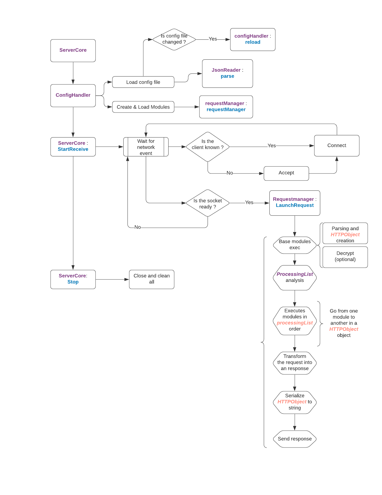

# Zia

Epitech 2021 : Tech 3 CPP Project

## Project

The goal of the Zia project is to create an HTTP server. This server will be able to serve typical HTTP documents and page requests, as well as CGI execution and more. The server MUST be written in C++, with support for interoperable modules

## API

Here is a class diagram of our API (it is much more complete than the required one)

And here is the API workflow

